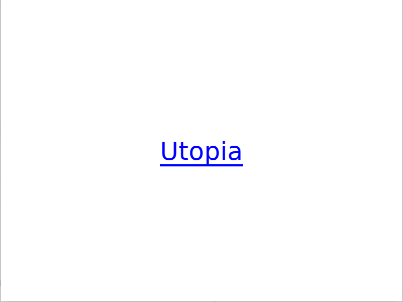
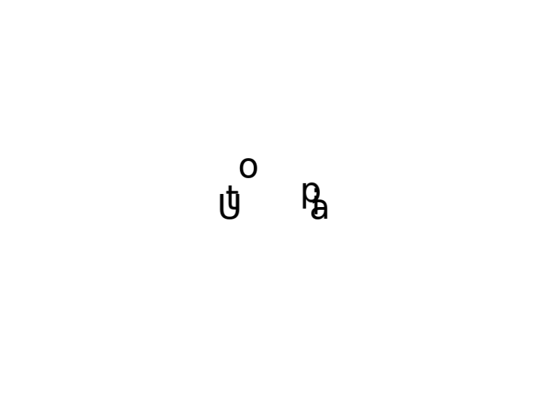

# 404 - Utopia not found
404 is an art project for DXARTS 200 taught by Afroditi Psarra at the University of Washington. The project is meant to explore the meaning of Utopia in both ways it can be interpreted as a "good place" or "no place". The project is a blank page with a hyperlink to Utopia. When the link is clicked it will literally break and the letters will move away from the mouse.

